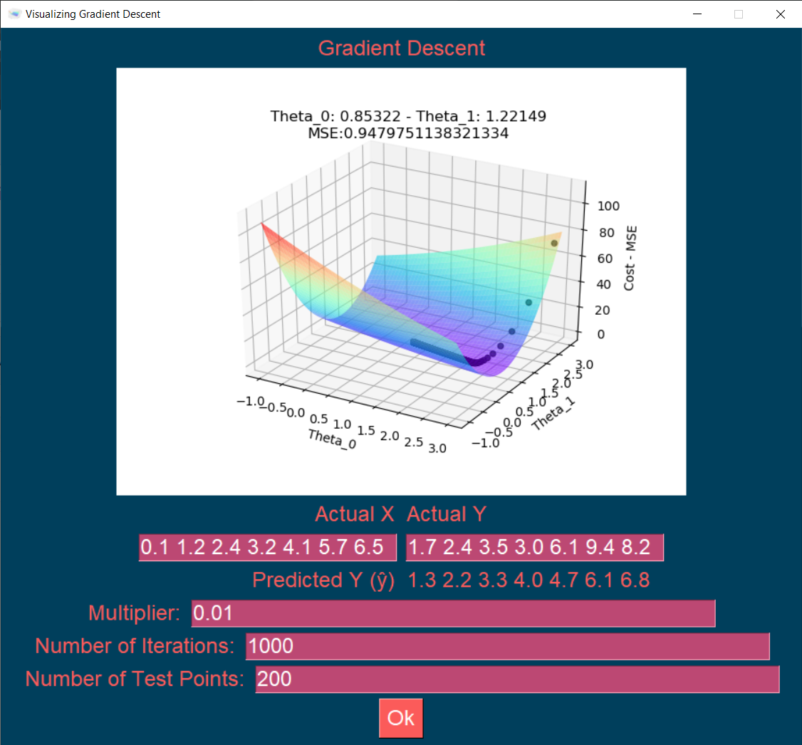

Gradient_Descent_GUI

This program is a GUI that calculates the Theta_0 and Theta_1 using MSE as the Cost Function given a set of X and Y points.
- There are multiple parameters the user can tweak, including entering their own X and Y data
- Program is meant to easily view linear regression using gradient descent.

